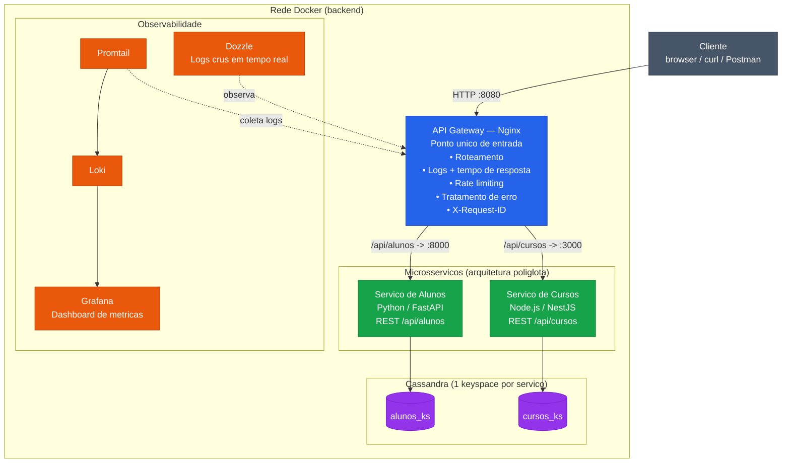

# Plataforma Acadêmica — API Gateway + Microsserviços

Arquitetura de microsserviços com **ponto único de entrada**: o cliente só fala com o
gateway Nginx, que roteia para os serviços internos. Os serviços e o banco **não expõem
portas para o host** — só são acessíveis dentro da rede Docker. Os dois serviços são
escritos em **linguagens diferentes** (Python e Node.js) de propósito: o gateway
**esconde a linguagem de implementação** do cliente (arquitetura poliglota).

## Arquitetura



## Stack

| Componente      | Tecnologia            | Função                                  |
|-----------------|-----------------------|-----------------------------------------|
| Gateway         | Nginx 1.27            | Roteamento, rate limit, logs, erros     |
| Serviço Alunos  | Python / FastAPI      | CRUD de alunos                          |
| Serviço Cursos  | Node.js / NestJS      | CRUD de cursos                          |
| Banco de dados  | Cassandra 4.1         | Persistência (1 keyspace por serviço)   |
| Logs crus       | Dozzle                | Logs de todos os containers em tempo real |
| Dashboard       | Promtail + Loki + Grafana | Métricas do gateway e tracing (latência, throughput, status) |
| Painel admin    | FastAPI + frontend    | Roteamento ao vivo, comparação gateway×direto, teste de carga |
| Tracing         | Cassandra `tracing_ks` | Tempos gateway→serviço por requisição (ms) |

## Portas

Apenas o **gateway** e as ferramentas de observabilidade ficam acessíveis pelo host:

| Serviço         | Porta no host | Porta interna | Acesso                                  |
|-----------------|---------------|---------------|-----------------------------------------|
| **Gateway**     | `8080`        | `80`          | http://localhost:8080                   |
| **Painel admin**| `8090`        | `8090`        | http://localhost:8090 (painel)          |
| **Grafana**     | `3001`        | `3000`        | http://localhost:3001 (dashboards)      |
| **Dozzle**      | `9999`        | `8080`        | http://localhost:9999 (logs crus)       |
| service-alunos  | — (interno)   | `8000`        | só na rede Docker (`service-alunos:8000`) |
| service-cursos  | — (interno)   | `3000`        | só na rede Docker (`service-cursos:3000`) |
| cassandra       | — (interno)   | `9042`        | só na rede Docker (`cassandra:9042`)    |

## Como rodar

Pré-requisitos: **Docker** e **Docker Compose**.

```bash
cd code
docker compose up --build
```

> A primeira subida demora alguns minutos: o Cassandra leva ~1 min para ficar *healthy*
> e só então o schema é carregado (container `cassandra-init`) e os serviços sobem.
> A ordem é garantida por `depends_on` + `healthcheck` — não é preciso fazer nada manual.

Para rodar em segundo plano e derrubar depois:

```bash
docker compose up --build -d     # sobe em background
docker compose down              # derruba (use -v para apagar os dados e o histórico)
```

## Demonstração

O roteiro completo (cobrindo todos os itens obrigatórios) está em
[demo/README.md](demo/README.md):

```bash
docker compose up --build -d
./demo/demo.sh                   # script guiado (Git Bash / WSL / Linux / macOS)
```

Ou importe a coleção `demo/ClickEscola.postman_collection.json` no Postman.

## Endpoints (via gateway)

Tudo passa por `http://localhost:8080`. O gateway remove o prefixo `/api/<serviço>`
antes de repassar (ex.: `/api/alunos` → `/alunos` no serviço).

| Método | Endpoint (gateway)        | Serviço destino | Descrição                  |
|--------|---------------------------|-----------------|----------------------------|
| GET    | `/health`                 | gateway         | Health check do gateway    |
| POST   | `/api/alunos`             | service-alunos  | Criar aluno                |
| GET    | `/api/alunos`             | service-alunos  | Listar alunos              |
| GET    | `/api/alunos/{id}`        | service-alunos  | Buscar aluno por id        |
| POST   | `/api/cursos`             | service-cursos  | Criar curso                |
| GET    | `/api/cursos`             | service-cursos  | Listar cursos              |
| GET    | `/api/cursos/{id}`        | service-cursos  | Buscar curso por id        |

### Exemplos

```bash
# Alunos
curl -X POST http://localhost:8080/api/alunos \
  -H "Content-Type: application/json" \
  -d '{"nome":"Maria Silva","email":"maria@escola.edu","matricula":"2024001"}'
curl http://localhost:8080/api/alunos
curl http://localhost:8080/api/alunos/<id>

# Cursos
curl -X POST http://localhost:8080/api/cursos \
  -H "Content-Type: application/json" \
  -d '{"nome":"Engenharia de Software","carga_horaria":3600}'
curl http://localhost:8080/api/cursos
curl http://localhost:8080/api/cursos/<id>

# Health do gateway
curl http://localhost:8080/health
```

> Cada serviço também tem um endpoint interno `/health` (`service-alunos:8000/health`,
> `service-cursos:3000/health`), acessível apenas de dentro da rede Docker — por exemplo:
> `docker compose exec gateway wget -qO- http://service-alunos:8000/health`.

## Recursos do gateway (Nginx)

- **Roteamento** por path (`/api/alunos`, `/api/cursos`) para upstreams na rede Docker.
- **Rate limiting**: 10 req/s por IP, com `burst` de 20.
- **Logs com tempo de resposta**: formato JSON incluindo `request_time` e
  `upstream_response_time` (tempo total vs. tempo do backend).
- **Tratamento de erro**: `proxy_intercept_errors` + `error_page` devolvem JSON amigável
  em caso de 502/503/504.
- **Rastreabilidade**: header `X-Request-ID` único por requisição, propagado ao backend
  e devolvido ao cliente.

## Observabilidade

Três camadas complementares:

- **Painel de administração — http://localhost:8090** — frontend próprio (sem login) com:
  - **Roteamento ao vivo**: tabela de cada requisição com a hora no serviço, o salto
    **gateway→serviço (ms)**, o tempo **no serviço (ms)** e o total — dados de *tracing*
    correlacionados por `X-Request-ID` e gravados no Cassandra (`tracing_ks`).
  - **Comparação gateway × direto**: mede N chamadas e mostra min/média/p50/p95 e o
    **overhead do gateway** em ms.
  - **Teste de carga**: botão que dispara 100 GET + 50 POST por serviço (2 GET : 1 POST).
  - Botões para abrir o Grafana e o Dozzle.
- **Grafana — http://localhost:3001** (abre sem login) — dois dashboards:
  - *"API Gateway — ClickEscola (tempo real)"* (`/d/clickescola-gw`): latência p50/p95,
    throughput por rota, status HTTP e log ao vivo do gateway.
  - *"Tracing — Roteamento Gateway → Serviço"* (`/d/clickescola-trace`): p95 do salto
    gateway→serviço e do processamento no serviço, por serviço.

  O Promtail lê os logs (JSON do Nginx + linhas de trace dos serviços) pelo Docker
  socket e envia ao Loki; o Grafana consulta o Loki.
- **Dozzle — http://localhost:9999** — logs crus de todos os containers em tempo real,
  linha a linha.

### Tracing distribuído (como funciona)

O Nginx envia ao backend o `X-Request-ID` e o `X-Request-Start` (hora de recebimento).
Cada serviço, via middleware (FastAPI) / interceptor (NestJS), calcula o salto
gateway→serviço e o tempo de processamento, grava em `tracing_ks.request_traces`
(TTL 1h) e emite uma linha JSON (`evt:"trace"`) para o Loki/Grafana.

## Trade-offs do API Gateway

| ✔ A favor (por que usar)                              | ✘ Custo (a discutir)                          |
|------------------------------------------------------|-----------------------------------------------|
| Ponto único de entrada e controle centralizado       | **Ponto único de falha** (mitigável com réplicas) |
| Segurança/rate limit/logs num só lugar               | **Latência extra** (1 hop a mais)             |
| Desacopla cliente dos serviços (esconde linguagem)   | Risco de virar **gargalo** sob carga          |
| Permite arquitetura **poliglota** (Python + NestJS)  | Mais um componente para operar/observar       |

## Estrutura do projeto

```
code/
├── docker-compose.yml          # orquestração de todos os containers
├── nginx/
│   └── nginx.conf              # configuração do gateway
├── cassandra/
│   └── init.cql                # keyspaces e tabelas (carregado na subida)
├── monitoring/                 # stack de observabilidade (dashboards)
│   ├── loki/loki-config.yml
│   ├── promtail/promtail-config.yml
│   └── grafana/                # datasource + 2 dashboards provisionados
├── demo/                       # roteiro da apresentação
│   ├── demo.sh
│   ├── docker-compose.override.demo.yml
│   ├── ClickEscola.postman_collection.json
│   ├── loadtest.k6.js          # teste de carga (k6)
│   └── README.md
├── service-alunos/             # FastAPI (Python) — com tracing
│   ├── main.py
│   ├── requirements.txt
│   └── Dockerfile
├── service-cursos/             # NestJS (Node.js) — com tracing
│   ├── src/                    # inclui tracing/tracing.interceptor.ts
│   ├── package.json
│   └── Dockerfile              # multi-stage (build + produção)
├── service-admin/              # FastAPI + frontend (painel de administração)
│   ├── main.py
│   ├── static/index.html
│   ├── requirements.txt
│   └── Dockerfile
└── README.md
```
